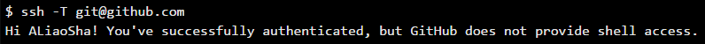
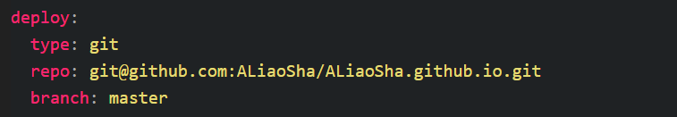

# 1. 前言

费了两天的劲终于能在自己搭建的博客上写东西了。对于我这个网页前端小白来说，遇到的坑确实不少。Hexo确实简单好用，不过如果想搭建一个界面漂亮的个人博客还是需要花时间折腾一番。这里我会比较详细的梳理我从无到有的搭建我的个人博客的过程，以及记录我踩过了那些坑。

# 2. 准备工作
hexo是基于node.js的所以你必须在node.js的官网上面下载并安装，这样你才能用npm。
我的博客是部署在github上面的，所以需要用到git。linux系统一般自带git，比较方便。Win用户需要在git官网下载安装git for windows并安装。顺便再这里推荐一下我使用的atom编辑器。它是github社区发布的一款面向21世纪的潮流编辑器。是基于web的编辑器.
## 注册你的github账号
这个网上很多明确的教程，推荐看一看[廖雪峰的git教程](http://www.liaoxuefeng.com/wiki/0013739516305929606dd18361248578c67b8067c8c017b000)
依次注册github账号，添加SSH-key, 设置用户名和邮箱，把秘钥添加到github里面就ok。
最后验证你的绑定是否成功：

## github上新建一个博客repo
在github上建立你的github page（相当于你要建立的个人博客）需要在你的github里面建立一个存放网站代码的repo，这个repo命名方式有规定。必须以你的github用户名+github.io的形式命名。比如：你的github用户名为abc,那么你的github page repo 要命名为abc.github.io
##  安装hexo
很简单只要一个命令
```
$ npm install hexo-cli -g
```
hexo就安装成功了。然后就可以搭建你的 网站。
- 新建一个文件夹，进入文件夹后用命令hexo init初始化。最简洁的是直接指定初始化的目录，hexo会自动生成它。然后cd进去。
```
$ hexo init myblog
$ cd myblog
```
- 安装依赖和插件
```
$ npm install
```

# 3. 开始搭建一个基本的框架
做好准备工作以后就要开始利用hexo生成你的博客了。  
`$ hexo g`命令帮助你生成静态页面到`myblog\public\`目录。  
`$ hexo s`命令启动本地服务，在浏览器打开  `localhost:4000`可以本地预览生成的博客网页。
# 4. 定制你的博客界面
在`https://hexo.io/themes/`上找到你喜欢的主题，点进预览界面以后找到该主题所在的github repo（我用的是[yscoder](https://github.com/yscoder/hexo-theme-indigo)的`indigo`主题）。然后到`mybolg\themes`目录下把这个repo 克隆下来 。接下来我们开始对主题文件进行自定义配置。
##　1. 配置全局_config.yml
全局_config.yml在myblog根目录下面。主要设置的就是`theme`和`deploy`选项。`theme`要设置为你刚才克隆的主题。deploy选项如下设置。repo后面填的是你的github page的地址。


##　2. 配置主题_config.yml
主题config里面的选项都很直白，相应的修改成你自己的就行。注意，设置头像或者其他图片文件的时候，图片放在`themes\indigo\source\img\`下。在设置的时候图片文件名大小写一定要对上。我就是因为把png图片的后缀没有写成`.PNG`查了好久都没查出来是什么问题。

更详细的设置可以参考[不如](http://ibruce.info/2013/11/22/hexo-your-blog/)的博客。
# 5. 解决数学公式的支持问题
由于我用的jSimple主题没有启用mathjax的配置，所以我采用的是安装hexo-math插件的方法,帮助我们渲染latex公式。
安装（注意命令一定要加--save）：

```
npm install hexo-math --save
```
安装时候提示信息可能显示这个插件已经deprecated。没有关系，只要能用就行。
设置： 在全局_config.yml文件中添加
```
plugins:
    - hexo-math
```
然后在你所用的theme主题的_config.yml文件中添加
```
# MathJax Support
math.mathjax:
  enable: true
  per_page: true
```
这样就启用了mathjax渲染公式。
我在实施了上面步骤之后发现自动部署的插件不能用了，报错为：“hexo ERROR Deployer not found: git” Google之后没发现什么明确的解决方法。我就把hexo-deployer-git也添加到plugins里面成功解决了这个报错。
```
plugins:
    - hexo-math
    - hexo-deployer-git
```
# 6. 使用插件
整个部署过程我就用了hexo-deployer-git和hexo-math两个插件。要想使用其他插件只需要在全局_config.yml文件的plugins下面添加插件名称就够了(当然，前提你先要hexo install)

# 7. References
[hexo你的博客|不如](http://ibruce.info/2013/11/22/hexo-your-blog/)  
[使用 Hexo 搭建博客的深度优化与定制](http://blog.tangxiaozhu.com/p/45374067/)  
[在 Jacman使用 Mathjax 输出数学式](http://wangcaiyong.com/2015/06/25/mathjax/)

[comment]:还有一大堆问题没有解决：
[comment]:  字体配置问题
[comment]:  图片插入问题
[comment]:  archives和about界面问题
[comment]:  部署以后的时候头像问题
[comment]:  插入的代码的时候显示代码block很丑陋>
